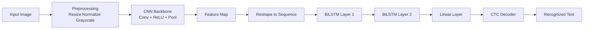
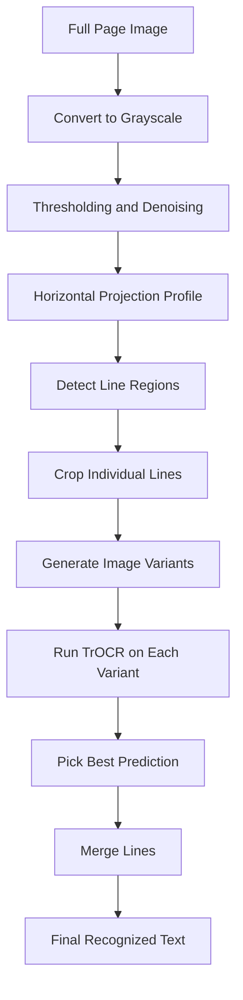

<div align="center">

# 🖊️ Handwritten Text Recognition

**Deep Learning pipeline for recognizing handwritten text — from raw image to structured output.**

[](https://python.org)
[](https://pytorch.org)
[](https://huggingface.co/microsoft/trocr-base-handwritten)
[](https://gradio.app)
[](LICENSE)
[](https://github.com/CelalIbrahimli/handwritten-text-recognition/stargazers)

<br/>

*Built from scratch with CNN + BiLSTM + CTC — plus Microsoft TrOCR for production-grade inference.*

</div>

---

## 📌 Overview

This project delivers a **complete Handwritten Text Recognition (HTR) system** — spanning custom model training, transformer-based OCR inference, and a deployable web application.

Two approaches are implemented and compared:

| Approach | Architecture | Best For |
|---|---|---|
| **Custom Model** | CNN → BiLSTM → CTC | Learning, experiments, fine-tuning |
| **Microsoft TrOCR** | Vision Transformer + Language Model | Production, generalization |

---

## 🗂️ Repository Structure

```
handwritten-text-recognition
│
├── app.py
├── requirements.txt
├── README.md
│
├── notebooks
│   ├── handwriting_recognition_model.ipynb
│   ├── reading_multiple_lines.ipynb
│   └── reading_multiple_lines_microsoft_model_ipynb.ipynb
│
└── models
    ├── best_model.pt
    └── htr_epoch043_best.pt
```

---

## 🧠 Model Architecture — Custom HTR





**Why CTC?** Connectionist Temporal Classification allows the model to train without character-level bounding box annotations — only word-level transcriptions are needed.

---

## 📊 Training Results

| Checkpoint | Epoch | CER ↓ |
|---|---|---|
| `htr_epoch043_best.pt` | 43 | **0.1038** |
| `best_model.pt` | — | — |
| `final_last.pt` | — | — |

> **CER (Character Error Rate)** — lower is better. CER = 0.10 means ~90% of characters are correctly recognized.

---

## 🔬 Multi-Line Page Recognition Pipeline

For full-page handwritten documents, a segmentation pipeline is applied before recognition:




---

## 🤖 Microsoft TrOCR Integration

Two TrOCR variants are supported via Hugging Face:

```python
from transformers import TrOCRProcessor, VisionEncoderDecoderModel

# Base model (faster)
processor = TrOCRProcessor.from_pretrained("microsoft/trocr-base-handwritten")
model = VisionEncoderDecoderModel.from_pretrained("microsoft/trocr-base-handwritten")

# Large model (higher accuracy)
model = VisionEncoderDecoderModel.from_pretrained("microsoft/trocr-large-handwritten")
```

| Model | Speed | Accuracy | Use Case |
|---|---|---|---|
| `trocr-base-handwritten` | ⚡ Fast | ✅ Good | Real-time apps |
| `trocr-large-handwritten` | 🐢 Slower | 🏆 Best | Offline batch |

---

## 🚀 Gradio Application

An interactive web app for uploading and transcribing handwritten images.

```bash
python app.py
```

**Features:**
- 📤 Upload any handwritten image (JPG, PNG)
- ✂️ Automatic line segmentation with visual preview
- 🔍 Line-by-line OCR using TrOCR
- 📋 Full transcript output
- 💾 Download extracted text as `.txt`

---

## ⚙️ Installation

```bash
# Clone the repository
git clone https://github.com/CelalIbrahimli/handwritten-text-recognition.git
cd handwritten-text-recognition

# Install dependencies
pip install -r requirements.txt
```

Or install manually:

```bash
pip install torch torchvision transformers accelerate \
            sentencepiece gradio opencv-python-headless \
            pillow matplotlib numpy
```

---

## 🧪 Usage Guide

### 1. Train the Custom Model

```bash
# Open in Jupyter
jupyter notebook handwriting_recognition_model.ipynb
```

- Configure dataset path and hyperparameters
- Model checkpoints saved automatically
- Evaluate with CER metric

### 2. Run Multi-Line Recognition

```bash
jupyter notebook reading_multiple_lines.ipynb
```

### 3. TrOCR Inference

```bash
jupyter notebook reading_multiple_lines_microsoft_model.ipynb
```

### 4. Web Application

```bash
python app.py
```

---

## 📦 Requirements

```
torch>=2.0.0
torchvision
transformers>=4.30.0
accelerate
sentencepiece
gradio
opencv-python-headless
pillow
matplotlib
numpy
```

---
## ⚠️ Limitations

- Custom model performance depends heavily on handwriting style similarity to training data
- Line segmentation may struggle with very dense or irregular spacing
- Poor image quality (low resolution, shadows, skew) reduces accuracy for all models
- TrOCR generalizes better across unseen handwriting styles

---

## 🤝 Contributing

Contributions, issues and feature requests are welcome!

1. Fork the repository
2. Create your feature branch (`git checkout -b feature/improvement`)
3. Commit changes (`git commit -m 'Add improvement'`)
4. Push to branch (`git push origin feature/improvement`)
5. Open a Pull Request

---

## 👨‍💻 Author

**Celal Ibrahimli**

[](https://www.linkedin.com/in/celal-ibrahimli-b7a47227b/)
[](https://github.com/CelalIbrahimli)
[](https://www.instagram.com/celaalibr/)

---

<div align="center">

**If this project helped you, please consider giving it a ⭐**

*Built with PyTorch · Transformers · OpenCV · Gradio*

</div>
